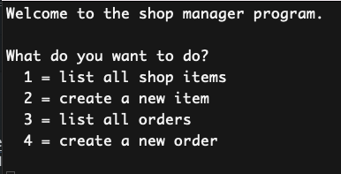

# Shop Manager Project

This is a project for the Makers Academy course. It is a terminal app that allows a user to manage a shop database containing some items and orders.
It is possible to view all items and orders, and to create new items and orders.

## Getting Started

1. Clone this repo to your local machine.
2. Run `bundle install` to install the required gems.
3. Create databases for running and testing the app:
```bash
createdb shop_manager_m2m
createdb shop_manager_m2m_test
```
4. Run the following commands to create the tables and seed the databases:
```bash
psql -h 127.0.0.1 shop_manager_m2m < spec/shop_manager_m2m_tables.sql
psql -h 127.0.0.1 shop_manager_m2m_test < spec/shop_manager_m2m_tables.sql
psql -h 127.0.0.1 shop_manager_m2m < spec/seeds_m2m.sql
psql -h 127.0.0.1 shop_manager_m2m_test < spec/seeds_m2m.sql
```
5. Run `ruby app.rb` to start the app in the terminal.

## Running tests

Run `rspec` to run the tests.
Important: There is an unresolved problem with the test that the technical coaches were unable to resolve and was certainly beyond my ability at that time. app.rb run method created a loop in the tests that made them hang despite working well in normal usage. As a result, app.rb line 22 must be uncommented to run the tests. This is not ideal but it is the only way I could get the tests to run at the time. I will return to this at a later date to try and resolve it.

## User Stories
```
As a shop manager
So I can know which items I have in stock
I want to keep a list of my shop items with their name and unit price.

As a shop manager
So I can know which items I have in stock
I want to know which quantity (a number) I have for each item.

As a shop manager
So I can manage items
I want to be able to create a new item.

As a shop manager
So I can know which orders were made
I want to keep a list of orders with their customer name.

As a shop manager
So I can know which orders were made
I want to assign each order to their corresponding item.

As a shop manager
So I can know which orders were made
I want to know on which date an order was placed. 

As a shop manager
So I can manage orders
I want to be able to create a new order.
```
## Example user interaction




The temrinal screen is cleared every time the user makes a selection from the menu.

## Notes on the project

I originally completed this solo challenge with a one-to-many relationship between items and orders as the project specification only required this.
I updated the project once complete to have a more satisfying many-to-many relationship between items and orders.

This is my first use of many to many tables and has not been fully integrated into the program.

What remains is to update the new order process so that it is possible to order more than one
item on a single order.
NOTE: the mechnanisms are there to have mulitple items on one order (order #2 already has) but
it is not yet possible to do this in app.rb. It is a fairly simple addition.
To be explored at a later date when I more time.

The program contains excess methods in the OrderRepository and ItemRepository classes.
These were implemented at the start of the project as part of my consilidation of the 
week's learning. I considered deleting them but they will be useful for reference and
for improving this project, e.g. updating and deleting.

### Technical Approach notes from Makers:

In this unit, you integrated a database by using the `PG` gem, and test-driving and building Repository classes. You can continue to use this approach when building this challenge.

[You'll also need to mock IO](https://github.com/makersacademy/golden-square/blob/main/mocking_bites/05_unit_testing_terminal_io_bite.md) in your integration or unit tests, since the program will ask for user input.

### Notes on test coverage from Makers:

Please ensure you have the following **AT THE TOP** of your spec_helper.rb in order to have test coverage stats generated
on your pull request:

```ruby
require 'simplecov'
require 'simplecov-console'

SimpleCov.formatter = SimpleCov::Formatter::MultiFormatter.new([
  SimpleCov::Formatter::Console,
  # Want a nice code coverage website? Uncomment this next line!
  # SimpleCov::Formatter::HTMLFormatter
])
SimpleCov.start
```

